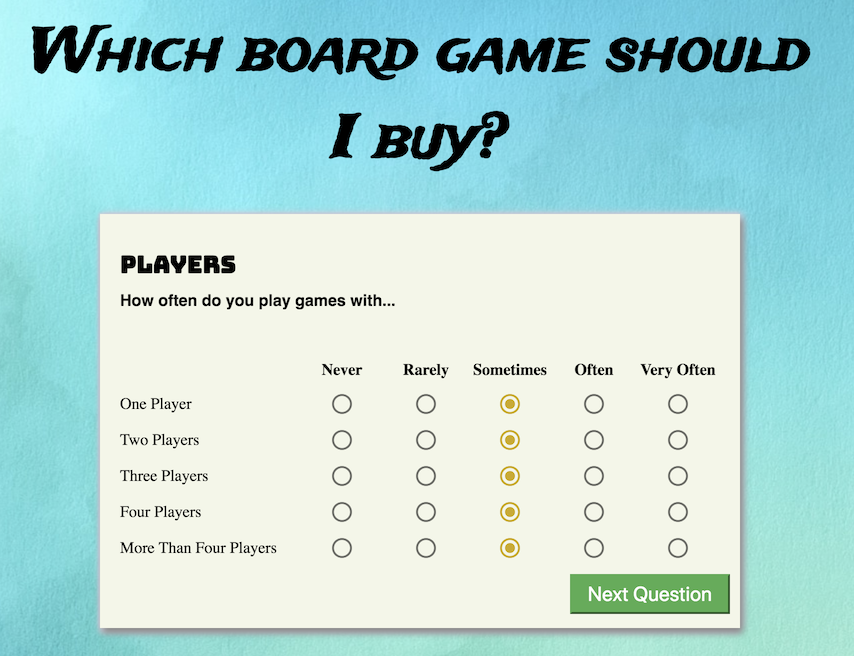

# Board Game Finder

This is react application which helps users decide which board game to purchase.
Users answer a questionnaire and based off user preferences and data from
[boardgamegeek.com] (http://boardgamegeek.com), this application ranks the five best matches.

## Built With

* [Create React App](https://github.com/facebookincubator/create-react-app)
* [Material UI] (https://material-ui.com/)
* [xml-js] (https://www.npmjs.com/package/xml-js)
* [Lodash](https://lodash.com//)
